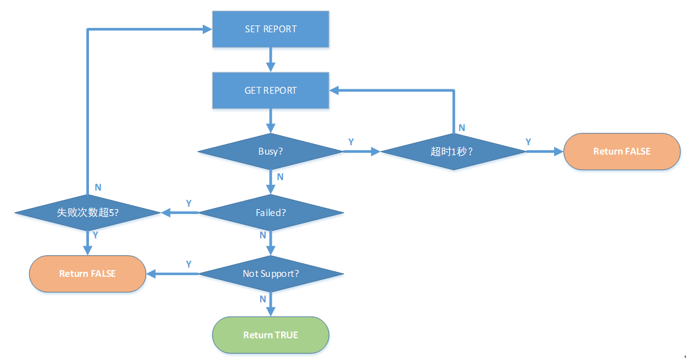

# 5.上位机 Protocol

### EndPoint 定义与描述
| NO | EndPoint | Type | Comment |
| :----: | :-----: | :-----:| :-----: |
| 1 | EP0 | Control,IN/OUT | USB Vendor Command |
| 2 | EP1 | Interrupt,IN | Mouse & Consume Key |
| 3 | EP2 | Interrupt,IN | Keyboard |
| 4 | EP3 | Interrupt,IN/OUT | Read/Write: Button Function, LED RGB, Profile, Macro, Update F/W |

### Report Data Structure

<table>
    <tr>
        <th white-space : nowrap> Byte \ Bit</th>
        <th> 7 </th>
        <th> 6 </th>
        <th> 5 </th>
        <th> 4 </th>
        <th> 3 </th>
        <th> 2 </th>
        <th> 1 </th>
        <th> 0 </th>
    </tr>
    <tr>
        <th> 0 </th>
        <th colspan = "8" align = "left"> Reprot ID ( Reserved )</th>
    </tr>
    <tr>
        <th> 1 </th>
        <th colspan = "8" align = "left"> CMD Status：0x00 ( Sucess ) ; 0x01 ( Busy ) ; 0x02 ( Failed ) ; 0x03 ( Not Support )</th>
    </tr>
    <tr>
        <th> 2 </th>
        <th colspan = "8" align = "left"> CMD ID ( 命令 ID )：见无线适配器和双模游戏鼠标主控具体命令协议</th>
    </tr>
    <tr>
        <th> 3 </th>
        <th colspan = "8" align = "left"> Data_Index ( 数据索引 LSB ): 命令的数据超过 57 Bytes 时，需要多次传输时的数据索引递减值。例如要传输 200 Bytes，则需要分 4 次传输，索引值依次为 3、2、1、0。0 表示最后一组数据</th>
    </tr>
    <tr>
        <th> 4 </th>
        <th colspan = "8" align = "left"> Data_Index ( 数据索引 MSB )</th>
    </tr>
    <tr>
        <th> 5 </th>
        <th colspan = "8" align = "left"> Data_Length ( 数据长度 ): 0~57 Bytes </th>
    </tr>
    <tr>
        <th> 6 </th>
        <th colspan = "8" align = "left"> Data 0 </th>
    </tr>
    <tr>
        <th> 7 </th>
        <th colspan = "8" align = "left"> Data 1 </th>
    </tr>
    <tr>
        <th> ...... </th>
        <th colspan = "8" align = "left"> Data ... </th>
    </tr>
    <tr>
        <th> 63 </th>
        <th colspan = "8" align = "left"> CheckSum: CheckSum = 55h - ( Byte0 + ... + Byte62 ) & 0xFF</th>
    </tr>
</table>

### CMD FLOW ( 命令流程 )

