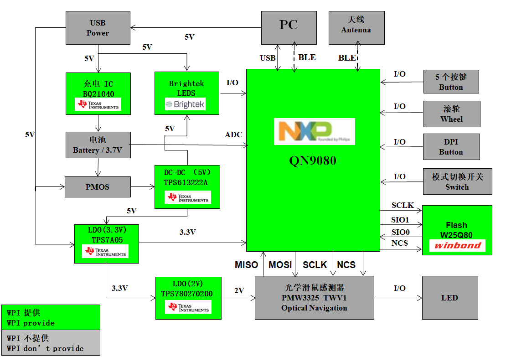

# 4.3.1.硬件介绍

### Block Diagram

### Function Description

1. 连接方式：USB / 2.4G
2. 工作方式：广电
3. USB Report Rate: 1000 Hz
4. 按键数：LB / RB / MB / 前进按键 / 后退按键 / DPI
5. 灯光效果：调节 RGB 呼吸灯，呼吸，智能光循环
6. 低功耗（续航半年）
7. 支持 USB 升级